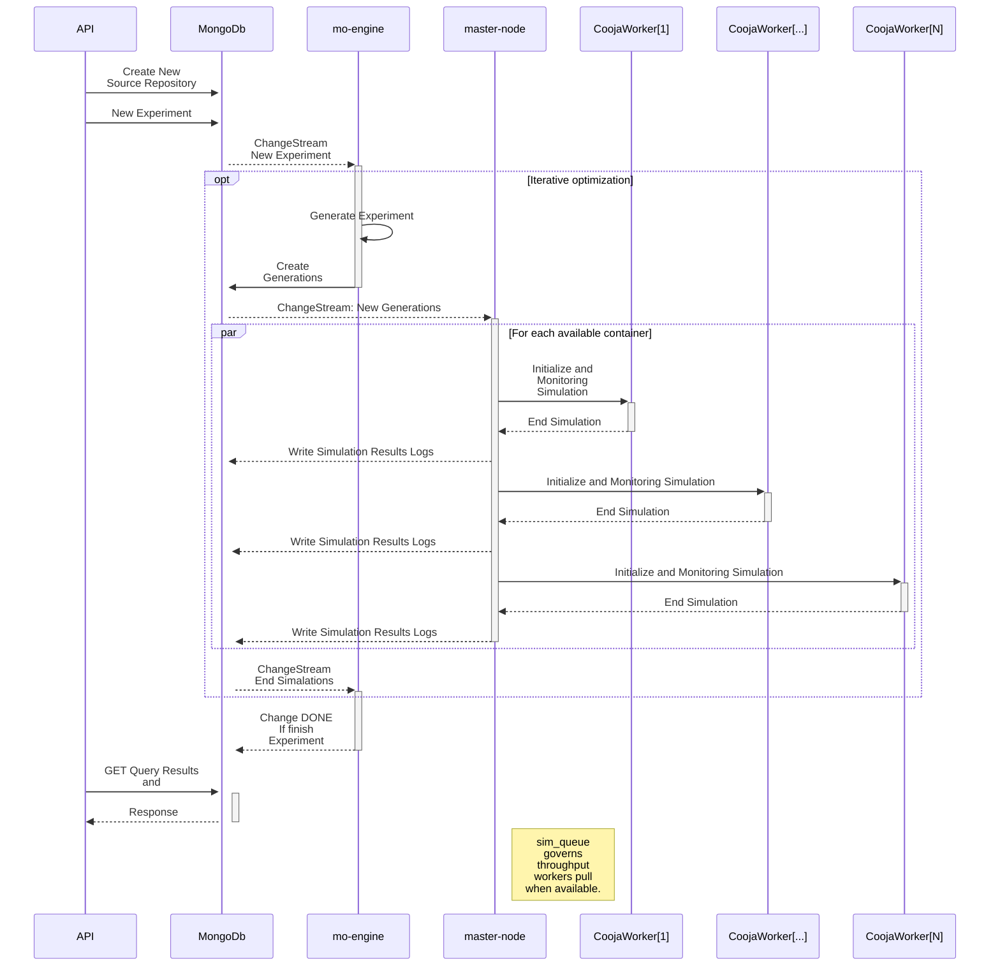

# MO-Cooja-Sim

## Overview
MO-Cooja-Sim is a research in scalable multi-objective optimization simulation system utilizing Cooja and Docker. It enables distributed simulations of evolutionary algorithms in a containerized environment, efficiently managing experiment workflows with Python, Go, and MongoDB.

## System Architecture
The system is composed of three main components:

1. **MO-Engine: Evolutionary Algorithm Module**
   - Runs an evolutionary algorithm to generate new candidate solutions.
   - Enqueues each new generation's elements in MongoDB for simulation.
   - Listens for simulation results via MongoDB Change Stream.

2. **Master-Node**
   - Consumes the simulation queue from MongoDB.
   - Dynamically spawns Docker containers for simulation execution.
   - Transfers simulation input data via SCP.
   - Monitors the simulation process via SSH.
   - Registers simulation results back to MongoDB.
   - Destroys the simulation container after execution.

3. **Cooja Simulation Containers**
   - Each container runs a Cooja instance to process a single simulation task.
   - Receives input data from Master-Node.
   - Generates and returns simulation results.

## Features
- **Scalable Execution:** Dynamic container provisioning ensures efficient resource utilization.
- **Distributed Processing:** Parallel execution of multiple simulations.
- **Seamless Data Flow:** Integration with MongoDB for real-time result processing.
- **Automation:** End-to-end automated execution from algorithm evolution to result collection.

## SimLab Work Sequence

Below is a simplified diagram of the SimLab workflow:

## Installation
### Prerequisites
- Docker & Docker Compose
- Python (>= 3.12)
- Go (>= 1.23)
- MongoDB
- [Docker Image Cooja (Contiki-NG environment)](https://github.com/JunioCesarFerreira/Cooja-Docker-VM-Setup)

### Setup Instructions

*It is yet to be completed.*

## Usage

*It is yet to be completed.*

## Future Enhancements
- Implement advanced scheduling mechanisms for simulation prioritization.
- Optimize container lifecycle management for cost efficiency.
- Extend support for additional optimization techniques.

## License
This project is licensed under the [MIT License](./LICENSE).

## Contributing
Contributions are welcome! Please submit issues or pull requests for improvements.
